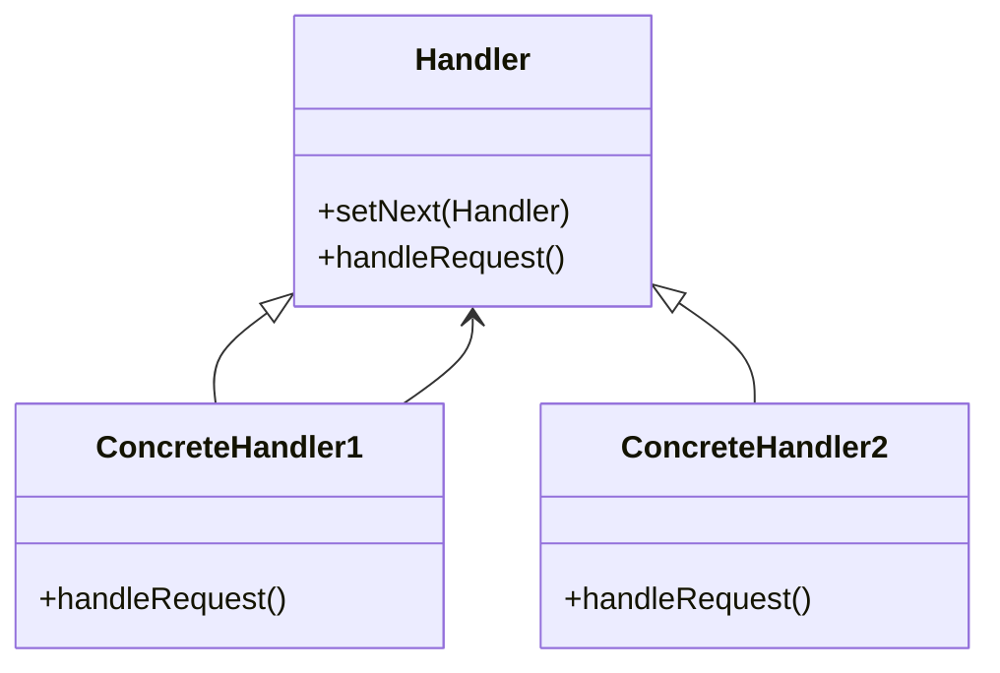

# Patrón chainOfResponsibility

## Explicación
**Handler**: interfaz base con método para manejar y establecer el siguiente manejador.

**ConcreteHandler**: maneja la solicitud o la pasa al siguiente.

**Cliente**: inicia la cadena sin conocer la estructura interna.
