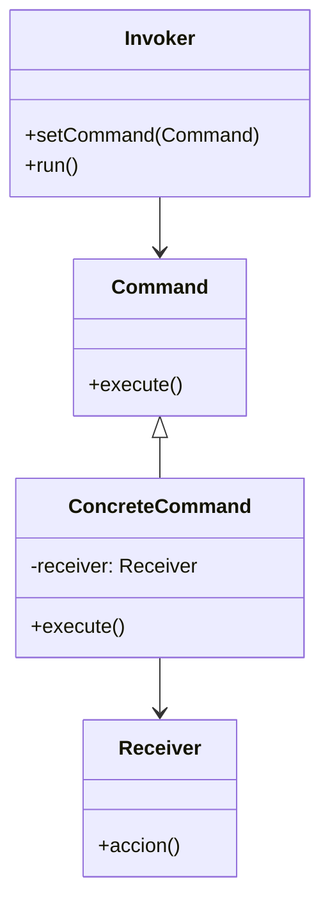

# Patrón command

## Explicación
**Command**: define una interfaz para ejecutar operaciones.

**ConcreteCommand**: implementa execute y llama a su receptor.

**Receiver**: contiene la lógica de la acción.

**Invoker**: ejecuta el comando sin saber cómo se hace.

**Cliente**: configura la relación entre comando y receptor.
