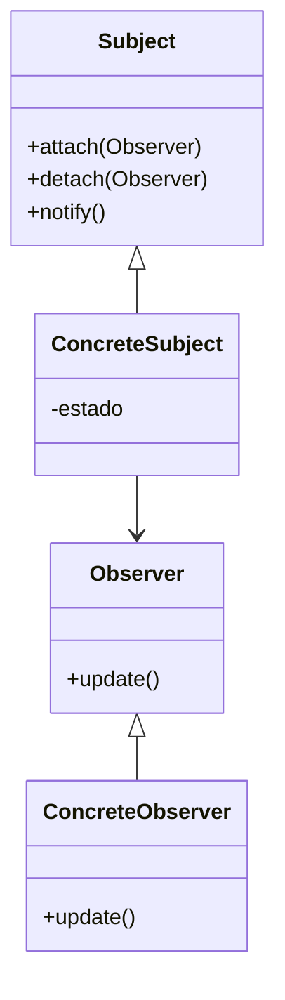

# Patrón observer

## Explicación
**Subject**: mantiene la lista de observadores y notifica cambios.

**Observer**: interfaz para actualizarse ante eventos.

**ConcreteSubject**: cambia de estado y notifica.

**ConcreteObserver**: reacciona a los cambios en el Subject.
