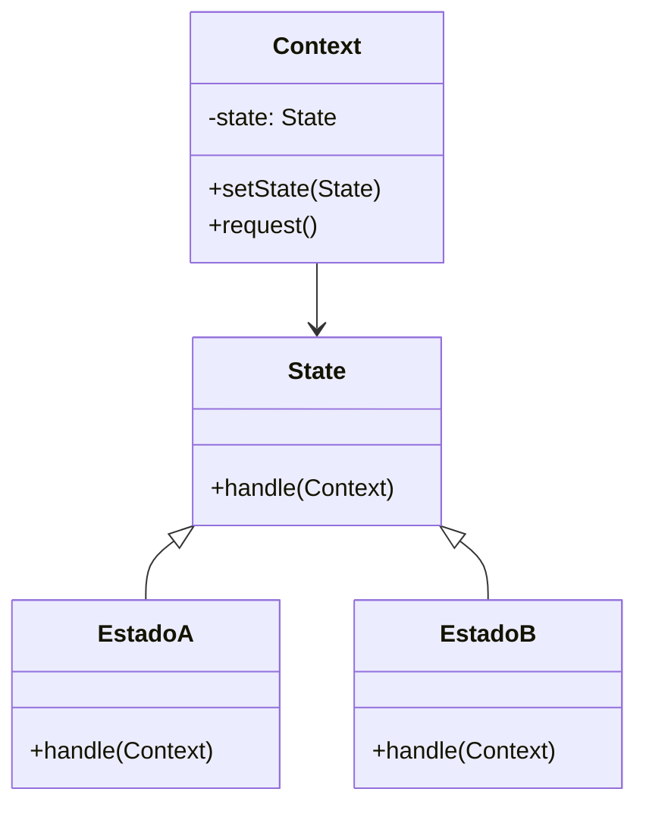

# Patrón state

## Explicación
**Context**: mantiene una referencia a un objeto de estado actual.

**State**: define la interfaz común para estados.

**EstadoA / EstadoB**: implementan comportamientos específicos y pueden cambiar el estado del contexto.
