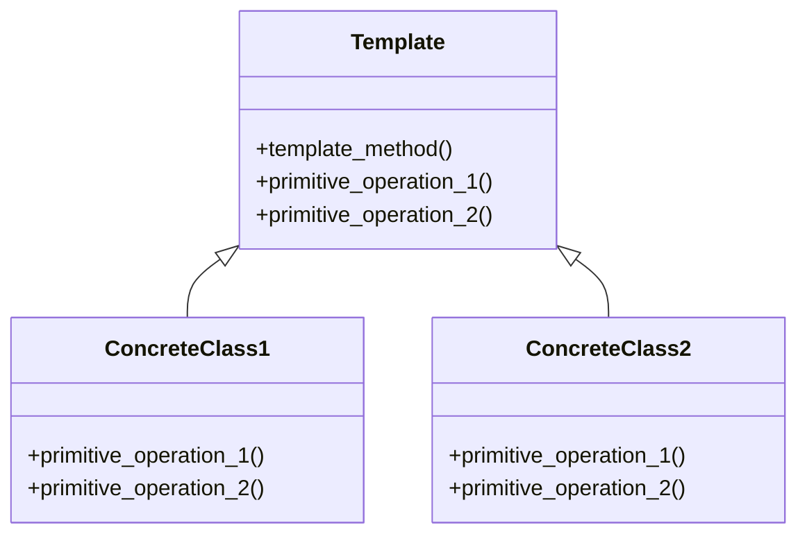

```mermaid
classDiagram
    class Template {
        +template_method()
        +primitive_operation_1()
        +primitive_operation_2()
    }

    class ConcreteClass1 {
        +primitive_operation_1()
        +primitive_operation_2()
    }

    class ConcreteClass2 {
        +primitive_operation_1()
        +primitive_operation_2()
    }

    Template <|-- ConcreteClass1
    Template <|-- ConcreteClass2
```