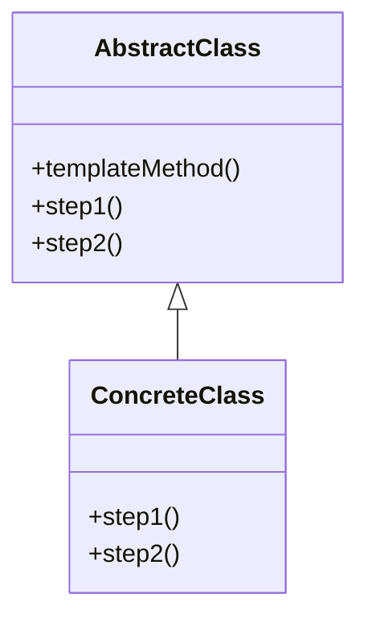

# Patrón templateMethod

```mermaid
classDiagram
    class AbstractClass {
        +templateMethod()
        +step1()
        +step2()
    }

    class ConcreteClass {
        +step1()
        +step2()
    }

    AbstractClass <|-- ConcreteClass
```

## Explicación
**AbstractClass**: define el esqueleto del algoritmo con algunos pasos abstractos.

**ConcreteClass**: implementa los pasos específicos del algoritmo.
