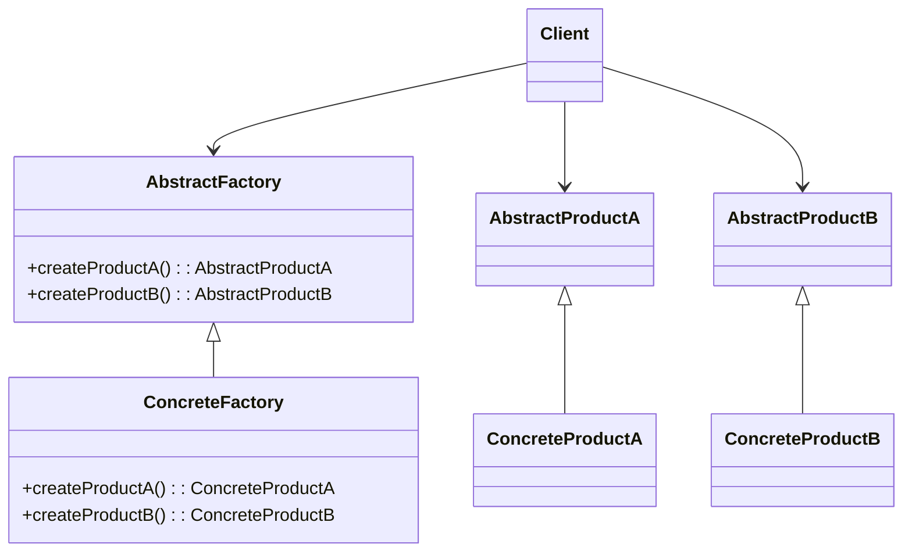

## Explicación
**AbstractFactory**: declara los métodos para crear productos abstractos.

**ConcreteFactory**: implementa los métodos para crear productos concretos.

**AbstractProductA / B**: interfaz para los productos.

**ConcreteProductA / B**: implementación real de productos.

**Client**: usa solo las interfaces sin conocer clases concretas.
