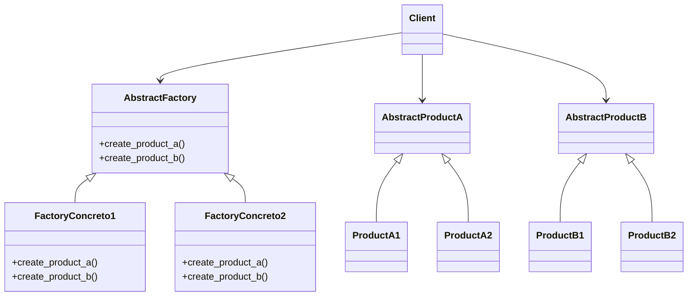

### Patrón Template Method

```mermaid
classDiagram
    class AbstractFactory {
        +create_product_a()
        +create_product_b()
    }

    class FactoryConcreto1 {
        +create_product_a()
        +create_product_b()
    }

    class FactoryConcreto2 {
        +create_product_a()
        +create_product_b()
    }

    class AbstractProductA
    class ProductA1
    class ProductA2

    class AbstractProductB
    class ProductB1
    class ProductB2

    class Client

    AbstractFactory <|-- FactoryConcreto1
    AbstractFactory <|-- FactoryConcreto2

    AbstractProductA <|-- ProductA1
    AbstractProductA <|-- ProductA2

    AbstractProductB <|-- ProductB1
    AbstractProductB <|-- ProductB2

    Client --> AbstractFactory
    Client --> AbstractProductA
    Client --> AbstractProductB
```