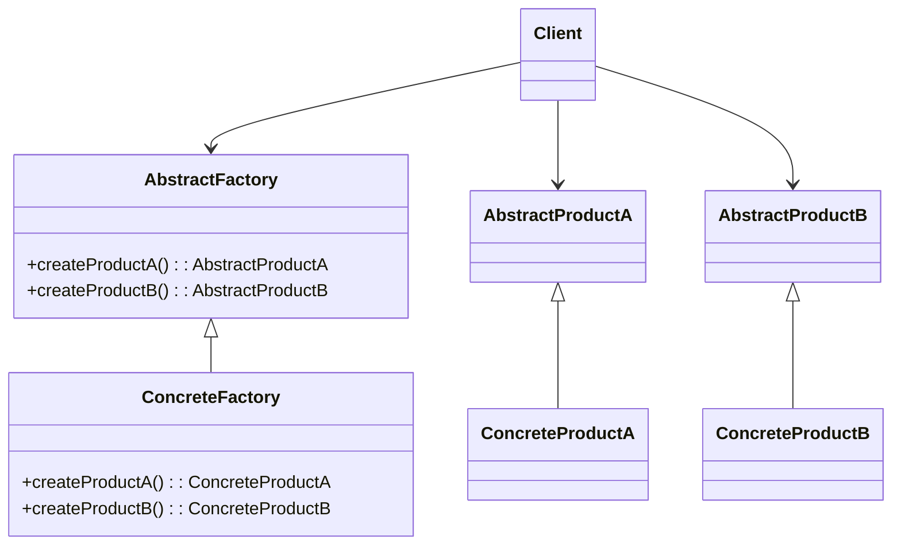

```python
# AbstractFactory: declara los métodos de creación de productos.
# ConcreteFactory: implementa esos métodos para retornar productos concretos.
# AbstractProductA: interfaz del primer tipo de producto.
# AbstractProductB: interfaz del segundo tipo de producto.
# ConcreteProductA: implementación real del primer tipo de producto.
# ConcreteProductB: implementación real del segundo tipo de producto.
```