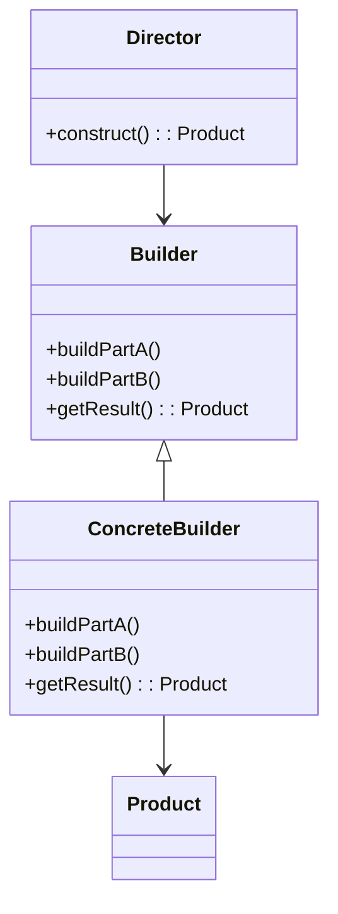

## Explicación
**Director**: construye un objeto usando el builder.

**Builder**: define los pasos de construcción.

**ConcreteBuilder**: construye partes específicas del objeto.

**Product**: resultado final del proceso.