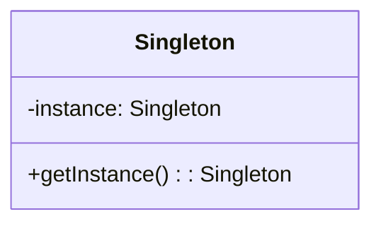

```mermaid
classDiagram
    class Singleton {
        -instance: Singleton
        +getInstance(): Singleton
    }
```

## Explicación
**Singleton**: asegura que una clase tenga solo una instancia y proporciona un punto de acceso global.
