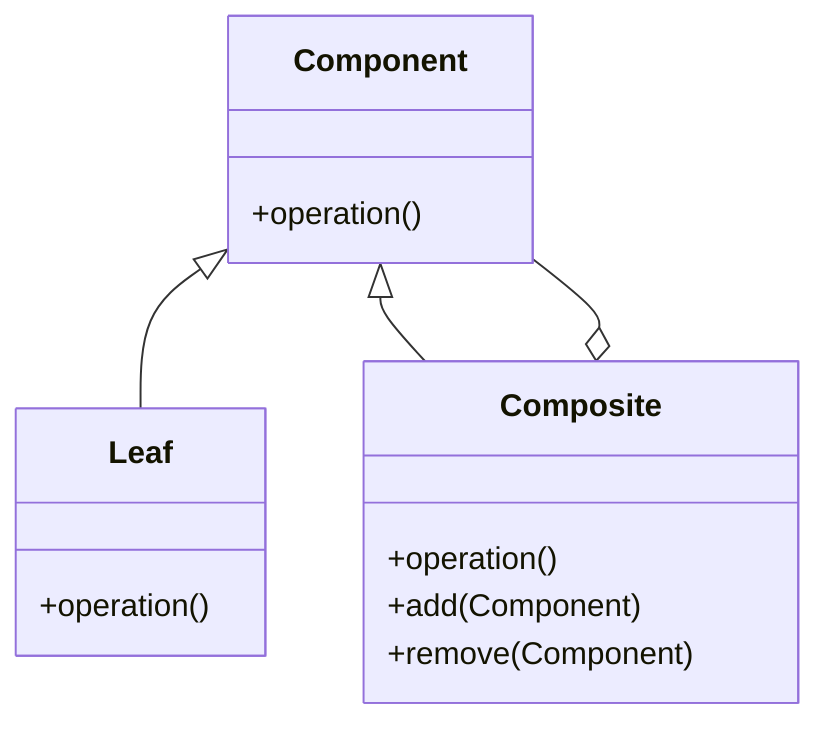

```mermaid
classDiagram
    class Component {
        +operation()
    }

    class Leaf {
        +operation()
    }

    class Composite {
        +operation()
        +add(Component)
        +remove(Component)
    }

    Component <|-- Leaf
    Component <|-- Composite
    Composite o-- Component
```

## Explicación
**Component**: interfaz común.

**Leaf**: representa los objetos sin hijos.

**Composite**: puede contener otros componentes y delega operaciones.