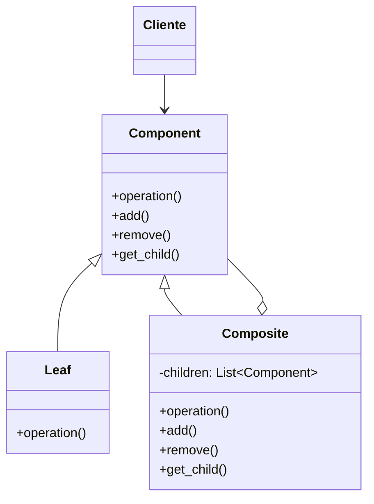

### Patrón Composite

```mermaid
classDiagram
    class Component {
        +operation()
        +add()
        +remove()
        +get_child()
    }

    class Leaf {
        +operation()
    }

    class Composite {
        +operation()
        +add()
        +remove()
        +get_child()
        -children: List~Component~
    }

    class Cliente

    Component <|-- Leaf
    Component <|-- Composite
    Composite o-- Component
    Cliente --> Component


```