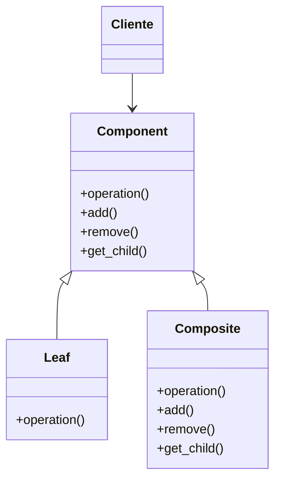

```mermaid
classDiagram
    class Component {
        +operation()
        +add()
        +remove()
        +get_child()
    }

    class Leaf {
        +operation()
    }

    class Composite {
        +operation()
        +add()
        +remove()
        +get_child()
    }

    class Cliente

    Component <|-- Leaf
    Component <|-- Composite
    Cliente --> Component
```