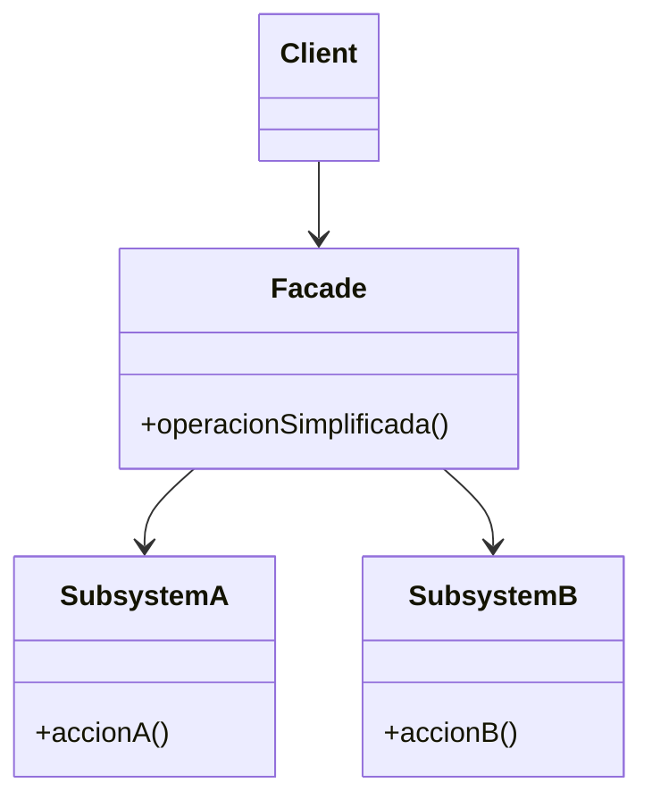

```mermaid
classDiagram
    class Client
    class Facade {
        +operacionSimplificada()
    }
    class SubsystemA {
        +accionA()
    }
    class SubsystemB {
        +accionB()
    }

    Client --> Facade
    Facade --> SubsystemA
    Facade --> SubsystemB
```

## Explicación
**Facade**: ofrece una interfaz simplificada a múltiples subsistemas.

**Subsystems**: realizan las tareas reales sin conocer al Facade.