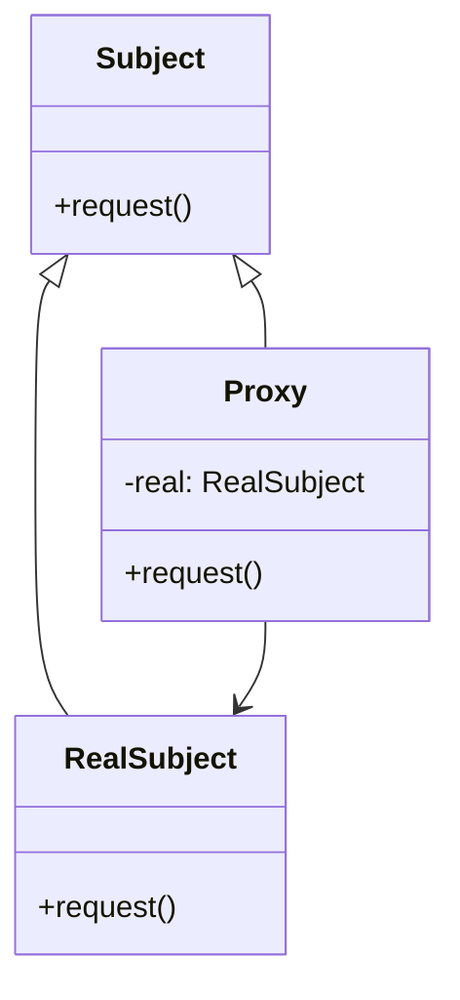

```mermaid
classDiagram
    class Subject {
        +request()
    }

    class RealSubject {
        +request()
    }

    class Proxy {
        +request()
        -real: RealSubject
    }

    Subject <|-- RealSubject
    Subject <|-- Proxy
    Proxy --> RealSubject
```

## Explicación
**Proxy**: actúa como intermediario entre el cliente y el objeto real.

**RealSubject**: objeto real.

**Client**: accede al proxy como si fuera el objeto real.